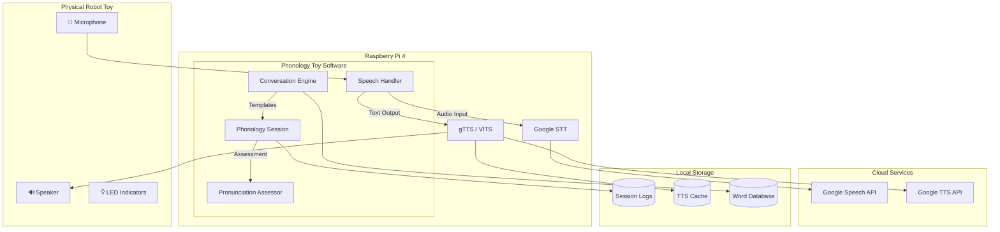
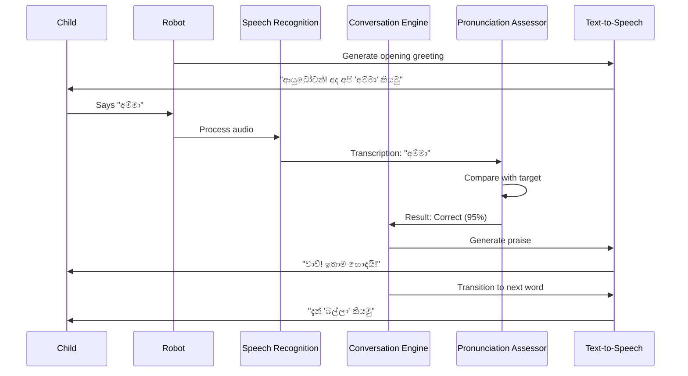

# Sinhala Phonology Education Toy 🤖🇱🇰

An **IOT-integrated conversational robot toy** for teaching Sinhala phonology to children aged 3-5 years.  
The system provides **real-time pronunciation assessment**, **encouraging feedback**, and **progress tracking** through natural Sinhala voice conversations.

This project implements a complete phonological therapy system with **Speech Recognition (STT)**, **Text-to-Speech (TTS)**, **pronunciation assessment algorithms**, and **session management** - all optimized for **Raspberry Pi** deployment.

---

## Features

- 🗣️ **Natural Sinhala Conversations** - Child-friendly dialogue templates
- 🎤 **Real-time Speech Recognition** - Google Speech API (si-LK) integration
- 🔊 **Text-to-Speech** - gTTS + Custom trained VITS model
- ✅ **Pronunciation Assessment** - Phoneme-aware fuzzy matching algorithm
- 📊 **Progress Tracking** - Session logging with detailed attempt history
- 🥧 **Raspberry Pi Optimized** - Low-resource deployment ready
- 👶 **Child-Focused Design** - Encouraging feedback, multiple attempts

---

## Architecture

- **Platform**: Raspberry Pi 4 (4GB RAM)
- **Language**: Python 3.9+
- **STT Engine**: Google Speech Recognition (si-LK)
- **TTS Engine**: gTTS (primary) + VITS (trained model available)
- **Assessment**: Levenshtein distance with phoneme equivalence rules
- **Storage**: JSON-based session logs

### High-Level Architecture Diagram



### Component Flow Diagram



---

## Project Structure

```
sinhala_phonology_toy/
│
├── main.py                     # Main entry point
├── config.py                   # Configuration + Word database
├── speech_handler.py           # STT/TTS integration
├── conversation_engine.py      # Sinhala conversation templates
├── phonology_session.py        # Session management + Assessment
├── simulation.py               # Testing without hardware
│
├── requirements.txt            # Python dependencies
├── setup_pi.sh                 # Raspberry Pi setup script
├── README.md                   # This file
│
├── data/
│   └── session_logs/           # JSON session logs
│
├── tts_cache/                  # Cached TTS audio files
│
├── audio/
│   └── recorded/               # Pre-recorded audio (optional)
│
└── models/
    └── sinhala_vits/           # Trained VITS model
        ├── model.pth           # Model weights
        └── config.json         # Model configuration
```

---

## Module Descriptions

### `main.py`
Main entry point for the interactive phonology session.
- Initializes all components
- Manages the interaction loop
- Handles session start/end

### `config.py`
Central configuration and word database.
- Audio settings, thresholds
- 50+ Sinhala words across 6 categories
- Phoneme information for teaching

### `speech_handler.py`
Handles all speech I/O operations.
- **STT**: Google Speech Recognition (si-LK)
- **TTS**: gTTS (default) + VITS model (available)
- Audio capture with voice activity detection

### `conversation_engine.py`
Generates natural Sinhala conversations.
- Opening/closing templates
- Success/retry responses
- Phoneme hints and teaching content

### `phonology_session.py`
Manages learning sessions.
- Word progress tracking
- Pronunciation assessment (Levenshtein + phoneme rules)
- Attempt history logging

### `simulation.py`
Testing without physical hardware.
- Automated simulation mode
- Interactive typing mode
- Demo showcase mode

---

## VITS TTS Model

A custom VITS (Variational Inference Text-to-Speech) model was trained for Sinhala female voice:

| Parameter | Value |
|-----------|-------|
| **Dataset** | 270 Sinhala audio samples |
| **Phonemes** | 52 unique Sinhala characters |
| **Model** | VITS |
| **Epochs** | 1000 |
| **GPU** | NVIDIA RTX 3050 (4GB VRAM) |
| **Training Time** | ~7.5 hours |
| **Framework** | Coqui TTS 0.22.0 |

**Note**: The model is integrated but gTTS is used as default for demo reliability. Enable VITS by setting `Config.USE_VITS = True`.

### Model Quality
- Current quality: Demo-level (limited by dataset size)
- Recommendation: 2000+ samples for production quality
- The model produces intelligible but slightly robotic output

---

## Word Database

| Category | Words | Examples |
|----------|-------|----------|
| **Beginner** | 13 | අම්මා, තාත්තා, බල්ලා, පොත |
| **Animals** | 9 | අලියා, සිංහයා, හාවා, කුරුල්ලා |
| **Family** | 8 | අක්කා, අයියා, ආච්චි, සීයා |
| **Body** | 7 | අත, ඇස, කන, නාසය |
| **Colors** | 6 | රතු, නිල්, කහ, කොළ |
| **Numbers** | 5 | එක, දෙක, තුන, හතර, පහ |

---

## Dependencies

Main dependencies used in this project:

```
# Core Audio
PyAudio>=0.2.13
pygame>=2.5.0
numpy>=1.24.0

# Speech Recognition
SpeechRecognition>=3.10.0

# Text-to-Speech
gTTS>=2.3.0

# Optional: VITS Model
TTS==0.22.0
torch>=2.0.0
```

---

## Installation & Setup

### 1. Prerequisites
- Python 3.9+
- pip
- Virtual environment (recommended)
- Microphone and speaker (for real hardware)

### 2. Clone the Repository

```bash
git clone <repository-url>
cd sinhala_phonology_toy
```

### 3. Create Virtual Environment

```bash
python -m venv venv
source venv/bin/activate    # Linux / macOS
venv\Scripts\activate       # Windows
```

### 4. Install Dependencies

```bash
pip install -r requirements.txt
```

### 5. Raspberry Pi Setup (Optional)

```bash
chmod +x setup_pi.sh
./setup_pi.sh
```

This installs system dependencies:
- PortAudio (microphone support)
- SDL2 (audio playback)
- Python audio libraries

---

## Running the Application

### Simulation Mode (No Hardware)

```bash
# Automated simulation
python simulation.py

# Interactive mode (type responses)
python simulation.py --interactive

# Demo showcase
python simulation.py --demo
```

### Full Application (With Hardware)

```bash
# Default 5-word session
python main.py

# Custom word count
python main.py --words 3

# Specific category
python main.py --category animals

# Simulation mode
python main.py --simulation

# Show system info
python main.py --info
```

---

## API Reference

### SpeechHandler

```python
from speech_handler import SpeechHandler
from config import Config

handler = SpeechHandler(Config())

# Listen for speech
audio = handler.listen(timeout=5.0)

# Transcribe audio
text = handler.transcribe(audio)

# Speak text
handler.speak("ආයුබෝවන්!")

# Combined listen + transcribe
text, audio = handler.listen_and_transcribe()
```

### PhonologySession

```python
from phonology_session import PhonologySession
from config import get_beginner_words

words = get_beginner_words(5)
session = PhonologySession(words, conversation_engine, config)

# Get current word
word = session.get_current_target()

# Assess pronunciation
is_correct, confidence, feedback = session.assess_pronunciation(
    target_word="අම්මා",
    transcription="අම්මා"
)

# Get results
results = session.get_results()
```

### ConversationEngine

```python
from conversation_engine import ConversationEngine

engine = ConversationEngine(config)

# Generate responses
opening = engine.generate_opening("අම්මා")
success = engine.generate_success_response("අම්මා", confidence=0.95)
retry = engine.generate_retry_response("අම්මා", attempt=2)
closing = engine.generate_closing(results)
```

---

## Session Output Example

```
╔══════════════════════════════════════════════════════════════╗
║                    SESSION SUMMARY                           ║
╠══════════════════════════════════════════════════════════════╣
║  Total Words:      5                                         ║
║  Correct:          4  ✓                                      ║
║  Skipped:          1  ⏭                                      ║
║  Success Rate:    80.0%                                      ║
║  Total Attempts:   8                                         ║
║  Duration:         3.5 min                                   ║
╠══════════════════════════════════════════════════════════════╣
║  WORD DETAILS:                                               ║
║  ✓ අම්මා      | 1 attempts | conf: 0.95                      ║
║  ✓ බල්ලා     | 2 attempts | conf: 0.85                      ║
║  ✓ පොත       | 1 attempts | conf: 0.90                      ║
║  ⏭ ගස        | 3 attempts | conf: 0.45                      ║
║  ✓ මල        | 1 attempts | conf: 1.00                      ║
╚══════════════════════════════════════════════════════════════╝
```

---

## Project Progress (50% Demo)

| Component | Progress | Status |
|-----------|----------|--------|
| 🤖 3D Robot Model Design | 100% | ✅ Complete |
| 🔊 Text-to-Speech (TTS) | 100% | ✅ Complete |
| ✅ Pronunciation Assessment | 100% | ✅ Complete |
| 📊 Session Management | 80% | 🔄 In Progress |
| 🎤 VITS TTS Model Training | 75% | 🔄 In Progress |
| 🗣️ Speech Recognition (STT) | 65% | 🔄 In Progress |
| 💬 Conversation Engine | 60% | 🔄 In Progress |
| 👶 Child ASR Model | 10% | ⏳ Started |

**Overall: 74%**

---

## Troubleshooting

### No audio input detected
```bash
# Check microphone
arecord -l
arecord -d 5 test.wav

# Adjust threshold in config.py
SILENCE_THRESHOLD = 300  # Lower = more sensitive
```

### gTTS errors
```bash
# Check internet connection
ping google.com

# Verify installation
python -c "from gtts import gTTS; print('OK')"
```

### PyAudio installation issues (Raspberry Pi)
```bash
sudo apt-get install portaudio19-dev python3-pyaudio
pip install PyAudio
```

---

## Future Enhancements

- [ ] Parent/Therapist dashboard (web app)
- [ ] Child speech optimization (custom ASR)
- [ ] Adaptive difficulty algorithm
- [ ] Offline mode (Whisper STT)
- [ ] LED/button GPIO integration
- [ ] Mobile app for progress monitoring
- [ ] Multi-language support

---

## Contributing

1. Fork the repository
2. Create a feature branch (`git checkout -b feature/amazing-feature`)
3. Commit changes (`git commit -m 'Add amazing feature'`)
4. Push to branch (`git push origin feature/amazing-feature`)
5. Open a Pull Request

---

## License

MIT License - Educational use encouraged.

---

## Acknowledgments

- [Coqui TTS](https://github.com/coqui-ai/TTS) - VITS model training
- [Google Speech API](https://cloud.google.com/speech-to-text) - Speech recognition
- [gTTS](https://github.com/pndurette/gTTS) - Text-to-speech
- SLIIT Faculty of Computing - Academic support

---

**Project:** IOT Robot Toy for Phonology-Based Conversation  
**Author:** IDDAMALGODA R. (IT22925336)  
**Institution:** SLIIT Faculty of Computing  
**Batch:** 25-26J-381  
**Date:** January 2026

---

Made with ❤️ for Sinhala-speaking children
